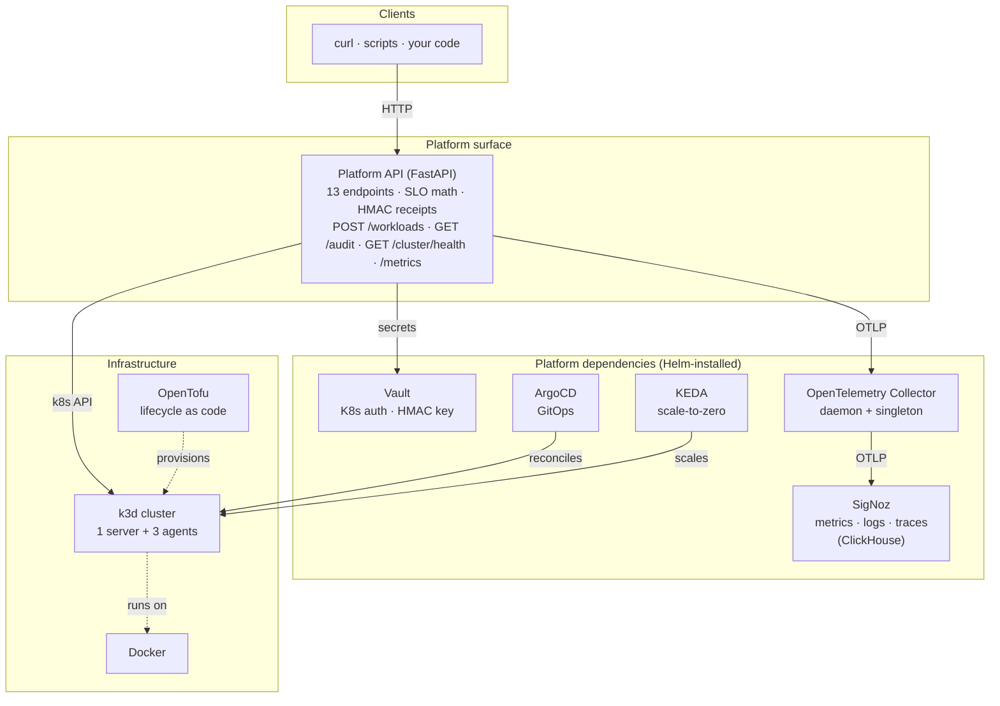
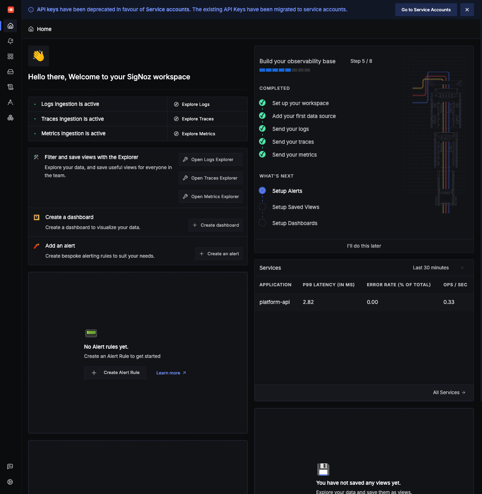
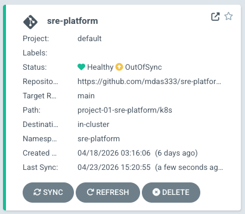
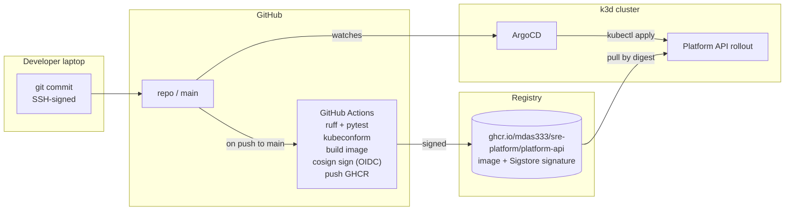
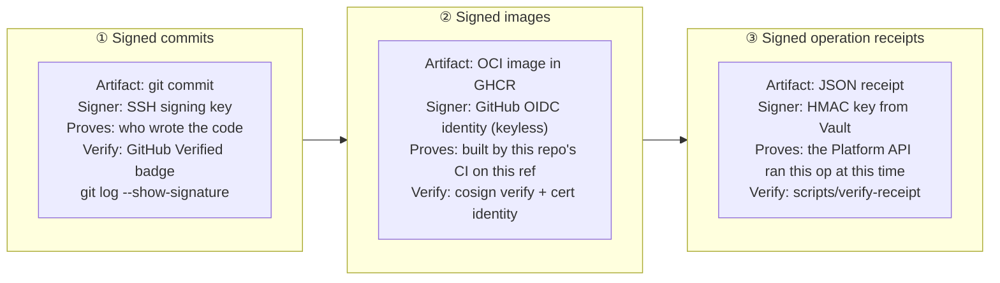

# sre-platform

[](https://github.com/mdas333/sre-platform/actions/workflows/ci.yml)


**An internal developer platform on Kubernetes, with SRE-grade reliability engineering built in — not bolted on.**


**By the numbers:** 12 tools integrated · 11 ADRs · 31 tests passing · 3 layers of signed provenance · 8-minute bring-up on an 8 GB Docker allocation.

**Jump to:**
[Problem](#problem) ·
[System at a glance](#the-system-at-a-glance) ·
[What it does](#what-it-does) ·
[See it live](#see-it-live) ·
[Tech stack](#tech-stack) ·
[Strengths](#strengths) ·
[Delivery pipeline](#delivery-pipeline) ·
[Quick start](#quick-start) ·
[Walkthrough →](./project-01-sre-platform/docs/WALKTHROUGH.md)

---

## Problem

Operating Kubernetes is only half the job. The harder half is giving the *developers* a product they can ship to — an API that hides the cluster, a health model that actually tells you if things are meeting their contract, and a delivery pipeline that is auditable end to end. This repository builds one, at laptop scale, with **every layer signed**: git commits, container images, and in-cluster operation receipts.

> A deep, beginner-friendly walkthrough of this project lives at [`project-01-sre-platform/docs/WALKTHROUGH.md`](./project-01-sre-platform/docs/WALKTHROUGH.md).

---

## The system at a glance



Four layers, strict boundaries. The Platform API does not care which tool backs Layer 2 as long as Vault, Kubernetes, and OTLP endpoints are present.

---

## What it does

| Capability | How |
|---|---|
| **Declarative cluster lifecycle** | `tofu apply` spins up a 4-node k3d cluster; `tofu destroy` tears it down. One command each. |
| **Two layers of scaling** | Node add / drain / remove via `scripts/scale-cluster-*.sh`; KEDA-driven scale-to-zero on a separate demo workload (the Platform API itself stays always-on). |
| **Error-budget-aware health** | Each workload registers an SLO at create-time. `/health` returns `healthy` / `burning` / `breached` based on budget math, not just HTTP 200. |
| **HMAC-signed operation receipts** | Every mutating call emits a canonical-JSON receipt signed with a Vault-sourced key. Verifiable offline via `scripts/verify-receipt`. |
| **OTel-native observability** | Metrics, logs, and traces sit in a single ClickHouse backed by SigNoz. Click a metric spike → see the trace, see the log — no tool switch. |
| **GitOps delivery, signed end to end** | Every commit SSH-signed; every image signed with keyless cosign via GitHub OIDC; ArgoCD reconciles from `main`. |

---

## See it live

SigNoz ingesting live telemetry from the Platform API — the `platform-api` service appears in the Services widget with P99 latency and op-rate computed from real traces:



ArgoCD reconciling the `sre-platform` Application — Synced / Healthy across all twelve resources, drift reverted automatically:



More screenshots (Docker Desktop, GitHub Actions, SigNoz Traces Explorer) live in the walkthrough's [Chapter 10 — Proof it works](./project-01-sre-platform/docs/WALKTHROUGH.md#10-proof-it-works).

---

## Tech stack

Every tool earns its place; each of the marked rows links to the ADR that justifies it.

| Layer | Tool | Role here | Why this one | ADR |
|---|---|---|---|---|
| Infrastructure | **k3d** | Multi-node Kubernetes in Docker | Real k3s, multi-node, seconds to start, node lifecycle is a first-class op | [0002](./shared/adr/0002-k3d-over-kind.md) |
| Infrastructure | **OpenTofu** | Infrastructure-as-code | MPL-2.0, Linux Foundation-governed, identical HCL to Terraform | [0003](./shared/adr/0003-opentofu-over-terraform.md) |
| Infrastructure | Docker · Helm | Container runtime · K8s package manager | Industry defaults — every other tool in this list builds on them | — |
| Platform deps | **Vault** | Secrets + HMAC signing key | Kubernetes auth method; the pod proves its identity with its SA token, no static credentials | [0006](./shared/adr/0006-vault-k8s-auth.md) |
| Platform deps | **ArgoCD** | GitOps controller | Cluster state reflects `main`; manual edits drift back automatically | — |
| Platform deps | **KEDA** | Event-driven autoscaling | Scale-to-zero, 60+ trigger types, production-proven | [0005](./shared/adr/0005-keda-over-hpa.md) |
| Platform deps | **SigNoz** | Observability backend | OpenTelemetry-native; metrics, logs, traces in one ClickHouse — no label-juggling across four tools | [0004](./shared/adr/0004-signoz-over-prometheus-grafana.md) |
| Platform deps | **OpenTelemetry** | Telemetry standard + Collector | Vendor-neutral; two Collectors (DaemonSet + singleton) cover five signal sources | — |
| Platform surface | **FastAPI** | Platform API framework | Async-native, Pydantic-typed, auto OpenAPI; pairs cleanly with the official `kubernetes` Python client | [0007](./shared/adr/0007-fastapi-with-official-k8s-client.md) |
| Platform surface | **SLO math in the API** | Server-side error-budget + burn-rate | Moves the health model from "is it up?" to "is it meeting its contract?" | [0010](./shared/adr/0010-slo-math-over-dashboards.md) |
| Platform surface | **Pluggable LLM adapter** | `/explain` endpoint | Off by default; opt-in to Gemini free-tier *or* offline Ollama. Multi-provider is the production pattern | [0011](./shared/adr/0011-pluggable-llm-backend.md) |
| Delivery | **Sigstore cosign** | Image signing | Keyless via GitHub OIDC — no private key to manage, rotate, or leak | [0008](./shared/adr/0008-sigstore-cosign-for-images.md) |
| Delivery | **HMAC-SHA256 (Vault-keyed)** | Operation receipts | Right instrument for in-band op signatures; cosign is for artifacts at rest | [0009](./shared/adr/0009-hmac-vault-for-receipts.md) |
| Delivery | GitHub Actions | CI | ruff → pytest → kubeconform → docker build → cosign sign → GHCR push | — |

---

## Strengths

The parts most portfolios don't do.

| Strength | Why it matters |
|---|---|
| **SLO math in the API, not a dashboard** | `/health` answers "meeting its contract?", not "is it alive?". Error budget + burn rate are Prometheus gauges ready for alerting. |
| **Three independent cryptographic signatures** | Commits (SSH), images (keyless cosign), and operation receipts (HMAC). Each signer, each verifier, each artifact is different. |
| **Vault Kubernetes auth from day one** | The Platform API identifies itself with its ServiceAccount token. No static passwords anywhere in the repo. |
| **Real Kubernetes integration, not mocks** | The official `kubernetes` Python client. `/cluster/nodes` returns the four real nodes; `/workloads` POST emits a receipt with a Vault-sourced `kid`. |
| **GitOps + supply-chain security composed together** | CI signs images via GitHub OIDC keyless cosign; ArgoCD reconciles from `main`. The verifier identity regex is a published, copy-pasteable command. |
| **OpenTelemetry from top to bottom** | Five receivers across the cluster, one ingestion path, one ClickHouse. Traces, metrics, logs correlate by `trace_id`. |
| **Breadth for P01, paved road for P03** | Every component a platform team integrates is here at laptop scale; Project 03 revisits them in a multi-environment paved-road form. |
| **AI, used tastefully** | `/explain` is **off by default** — zero-friction clone-and-run. Opt-in to Gemini (free AI Studio) or offline Ollama. |

---

## Delivery pipeline



Verify any image this repo has published:

```bash
cosign verify \
  --certificate-identity-regexp '^https://github\.com/mdas333/sre-platform/\.github/workflows/ci\.yml@refs/heads/.*' \
  --certificate-oidc-issuer 'https://token.actions.githubusercontent.com' \
  ghcr.io/mdas333/sre-platform/platform-api:main
```

The regex pins verification to *this* repo's `ci.yml` workflow on any branch — any signature produced by a different workflow fails.

---

## Three layers of provenance



Together, the three answer *who wrote this, who built what is running, and who performed this operation* — without trusting any single party.

---

## Project arc

| # | Project | Theme | Status |
|---|---------|-------|--------|
| 01 | [`sre-platform`](./project-01-sre-platform/) | Platform API + SLO math + signed receipts on k3d | **Current** |
| 02 | [`ai-sre-agent`](./project-02-ai-sre-agent/) | Agentic SRE assistant on top of Project 01 | Planned |
| 03 | [`paved-road`](./project-03-paved-road/) | Multi-environment GitOps with policy-as-code | Planned |
| 04 | [`sentinel`](./project-04-sentinel/) | Predictive reliability capstone | Planned |

---

## Quick start

**Prerequisites:** Docker Desktop running; macOS or Linux; Homebrew (for installing CLI tools). Tested on Docker Desktop with **8 GB memory and 14 CPUs**; measured peak memory across the full six-namespace stack is ≈ 4.5 GB. Bring-up completes in about **8 minutes**.

```bash
# One-time: install the CLIs this project expects.
brew install k3d helm kubectl opentofu hashicorp/tap/vault cosign jq hey asciinema agg

# Verify the environment.
./shared/scripts/preflight.sh

# Bring everything up.
cd project-01-sre-platform
./scripts/cluster-up.sh                                  # ≈8 min

# Reach the Platform API (port-forward in one terminal, curl in another).
kubectl -n sre-platform port-forward svc/platform-api 8080:80 &
curl http://localhost:8080/cluster/health | jq
```

Teardown: `./scripts/cluster-down.sh`.

---

## See also

- **[Walkthrough](./project-01-sre-platform/docs/WALKTHROUGH.md)** — exhaustive, beginner-friendly, 13 chapters, 7 Mermaid diagrams, live proof outputs, four integrated screenshots. Start here if the stack is unfamiliar.
- **[Project 01 README](./project-01-sre-platform/README.md)** — project-level architecture, API surface, scaling demos, tests, CI.
- **[Architecture decisions](./shared/adr/)** — eleven ADRs, one per real trade-off.
- **[Capabilities index](./shared/capabilities.md)** — what the code implements, with pointers to files and ADRs.
- **[Glossary](./shared/glossary.md)** — beginner vocabulary for the tools and concepts.
- **[Demos](./project-01-sre-platform/docs/demos/)** — recorded GIFs of cluster scaling and KEDA scale-to-zero.

---

## Author

**Moulima Das** — DevOps / SRE engineer with six years of production Kubernetes experience. Open to remote Senior SRE / Platform Engineer roles.

GitHub: [mdas333](https://github.com/mdas333)

## License

MIT — see [LICENSE](./LICENSE).
