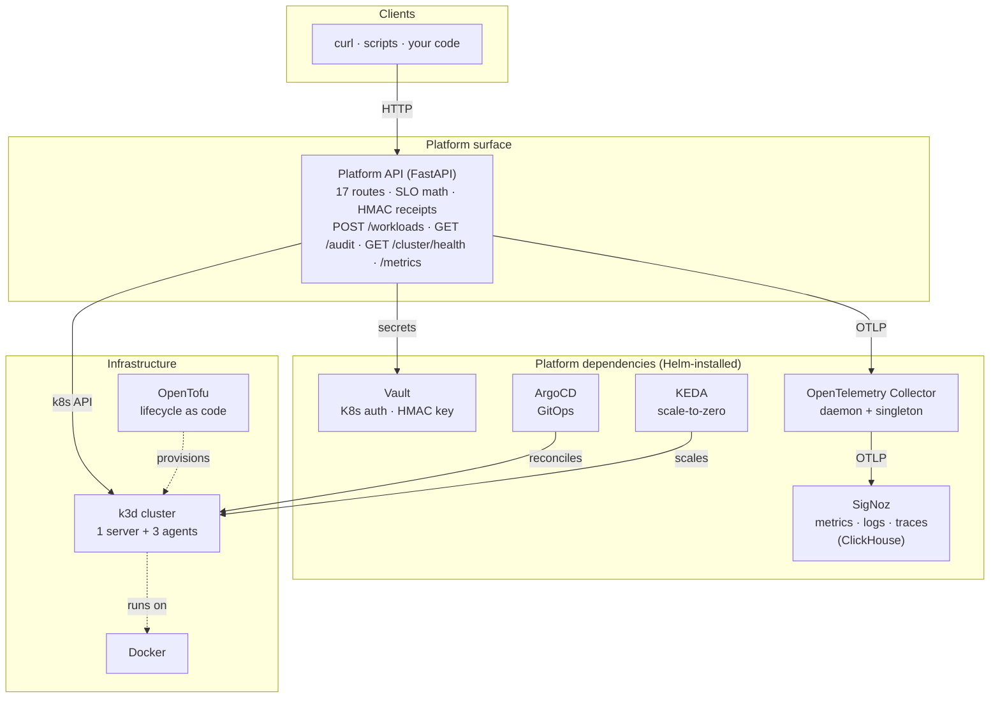
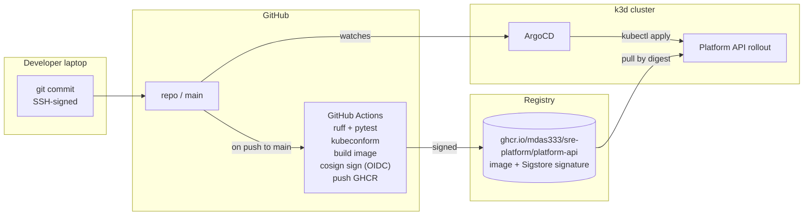
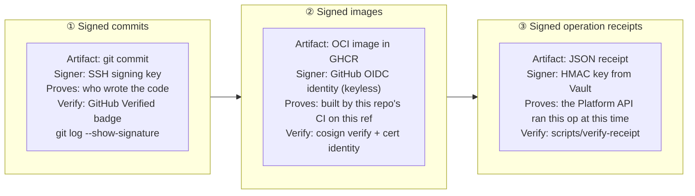

# sre-platform

[](https://github.com/mdas333/sre-platform/actions/workflows/ci.yml)


**An internal developer platform on Kubernetes, with SRE-grade reliability engineering built in — not bolted on.**

---

## Problem

Operating Kubernetes is only half the job. The harder half is giving the *developers* a product they can ship to — an API that hides the cluster, a health model that actually tells you if things are meeting their contract, and a delivery pipeline that is auditable end to end. This repository builds one, at laptop scale, with **every layer signed**: git commits, container images, and in-cluster operation receipts.

> **A deep, beginner-friendly walkthrough of this project lives at [`project-01-sre-platform/docs/WALKTHROUGH.md`](./project-01-sre-platform/docs/WALKTHROUGH.md).**

---

## The system at a glance



Four layers, strict boundaries. The Platform API does not care which tool backs Layer 2 as long as Vault, Kubernetes, and OTLP endpoints are present.

---

## What it does

| Capability | How |
|---|---|
| **Declarative cluster lifecycle** | `tofu apply` spins up a 4-node k3d cluster; `tofu destroy` tears it down. One command each. |
| **Two layers of scaling** | Node add/drain/remove via `scripts/scale-cluster-*.sh`; KEDA-driven scale-to-zero on a separate demo workload (the Platform API itself stays always-on). |
| **Error-budget-aware health** | Each workload registers an SLO at create-time. `/health` returns `healthy` / `burning` / `breached` based on budget math, not just HTTP 200. |
| **HMAC-signed operation receipts** | Every mutating call emits a canonical-JSON receipt signed with a Vault-sourced key. Verifiable offline via `scripts/verify-receipt`. |
| **OTel-native observability** | Metrics, logs, and traces sit in a single ClickHouse backed by SigNoz. Click a metric spike → see the trace, see the log — no tool switch. |
| **GitOps delivery, signed end to end** | Every commit SSH-signed; every image signed with keyless cosign via GitHub OIDC; ArgoCD reconciles from `main`. |

Recorded demos of both scaling layers live inline in [Project 01's README](./project-01-sre-platform/README.md#scaling).

---

## Tech stack — and why each tool

| Tool | Role | Why this one | ADR |
|---|---|---|---|
| **k3d** | Multi-node Kubernetes in Docker | Real k3s, multi-node, seconds to start, node lifecycle is a first-class op | [0002](./shared/adr/0002-k3d-over-kind.md) |
| **OpenTofu** | Infrastructure-as-code | MPL-2.0, Linux Foundation governed, identical HCL to Terraform | [0003](./shared/adr/0003-opentofu-over-terraform.md) |
| **SigNoz** | Observability backend | OpenTelemetry-native, single ClickHouse — no label-juggling across 4 tools | [0004](./shared/adr/0004-signoz-over-prometheus-grafana.md) |
| **KEDA** | Event-driven autoscaling | Scale-to-zero, 60+ trigger types, production-proven | [0005](./shared/adr/0005-keda-over-hpa.md) |
| **Vault** | Secrets + cryptographic keys | Kubernetes auth method — the pod proves its identity with its SA token, no static credentials | [0006](./shared/adr/0006-vault-k8s-auth.md) |
| **FastAPI** | Platform API framework | Async-native, Pydantic-typed, auto OpenAPI, pairs cleanly with the official `kubernetes` Python client | [0007](./shared/adr/0007-fastapi-with-official-k8s-client.md) |
| **Sigstore cosign** | Image signing | Keyless via GitHub OIDC — no private key to manage | [0008](./shared/adr/0008-sigstore-cosign-for-images.md) |
| **HMAC-SHA256 (Vault-keyed)** | Operation receipts | Right instrument for in-band op signatures; cosign is for artifacts at rest | [0009](./shared/adr/0009-hmac-vault-for-receipts.md) |
| **SLO math in the API** | Reliability signal | Server-side error budget + burn rate beats dashboard engineering | [0010](./shared/adr/0010-slo-math-over-dashboards.md) |
| **Pluggable LLM adapter** | `/explain` endpoint | Off by default; opt-in to Gemini free tier or offline Ollama. Multi-provider is the production pattern | [0011](./shared/adr/0011-pluggable-llm-backend.md) |
| **ArgoCD · Helm · Docker · OTel** | GitOps controller · K8s package mgr · containers · telemetry standard | Industry defaults; each earns its place | — |

---

## Strengths (the parts most portfolios don't do)

1. **SLO math lives in the API, not a dashboard.** Error budget + burn rate are computed server-side and exposed as Prometheus gauges. The `/health` endpoint answers "is it meeting its contract?", not "is it alive?".
2. **Three independent cryptographic signatures.** Commits (SSH), images (keyless cosign), and operation receipts (HMAC) — each proves a different thing.
3. **Kubernetes-auth Vault integration from day one.** The Platform API authenticates with its ServiceAccount token. No static passwords anywhere in the repo.
4. **Real K8s integration, not mocks.** The Platform API uses the official `kubernetes` Python client. Live `/cluster/nodes` returns the four real nodes; live `/workloads` POST emits a receipt with a Vault-sourced `kid`.
5. **GitOps + supply-chain security composed together.** CI signs images via GitHub OIDC keyless cosign; ArgoCD reconciles manifests from `main`. `cosign verify` against a regex of the repo's workflow identity is a published, copy-pasteable command.
6. **OpenTelemetry from top to bottom.** Five receivers across the cluster, one ingestion endpoint, one ClickHouse datastore. Traces, metrics, and logs correlate by `trace_id`.
7. **Breadth over depth for Project 01, paved-road for Project 03.** Every component a platform team typically integrates is here; the next project revisits them in a multi-environment form.
8. **AI integration, used tastefully.** The `/explain` endpoint is off by default. When enabled, it speaks to Gemini (free tier) or Ollama (local). Zero-friction clone-and-run.

---

## Delivery pipeline — signed all the way



Verify any image this repo has published:

```bash
cosign verify \
  --certificate-identity-regexp '.*mdas333/sre-platform.*' \
  --certificate-oidc-issuer 'https://token.actions.githubusercontent.com' \
  ghcr.io/mdas333/sre-platform/platform-api:main
```

---

## Three layers of provenance



Together, the three answer *who wrote this, who built what is running, and who performed this operation* — without trusting any single party.

---

## Project arc

| # | Project | Theme | Status |
|---|---------|-------|--------|
| 01 | [`sre-platform`](./project-01-sre-platform/) | Platform API + SLO math + signed receipts on k3d | Current |
| 02 | [`ai-sre-agent`](./project-02-ai-sre-agent/) | Agentic SRE assistant on top of Project 01 | Planned |
| 03 | [`paved-road`](./project-03-paved-road/) | Multi-environment GitOps with policy-as-code | Planned |
| 04 | [`sentinel`](./project-04-sentinel/) | Predictive reliability capstone | Planned |

---

## Quick start (Project 01)

Prerequisites: Docker Desktop running, Homebrew available. Tested on Docker Desktop with **8 GB memory and 14 CPUs**; measured peak memory across the full six-namespace stack is ≈ 4.5 GB. Bring-up completes in about **8 minutes**.

```bash
./shared/scripts/preflight.sh           # verify local tooling
cd project-01-sre-platform
./scripts/cluster-up.sh                 # full stack in ~8 min
# curl the Platform API:
kubectl -n sre-platform port-forward svc/platform-api 8080:80 &
curl http://localhost:8080/cluster/health | jq
```

Teardown: `./scripts/cluster-down.sh`.

---

## Navigation

- **[Walkthrough](./project-01-sre-platform/docs/WALKTHROUGH.md)** — exhaustive, beginner-friendly, Mermaid diagrams, proof outputs. Start here if the stack is unfamiliar.
- **[Project 01 README](./project-01-sre-platform/README.md)** — project-level architecture, API surface, scaling demos, tests, CI, status.
- **[Architecture decisions](./shared/adr/)** — 11 ADRs, one per real trade-off.
- **[Capabilities index](./shared/capabilities.md)** — what the code implements, with pointers.
- **[Glossary](./shared/glossary.md)** — the vocabulary used here.
- **[Demos](./project-01-sre-platform/docs/demos/)** — recorded GIFs of cluster scaling + KEDA scale-to-zero.

---

## Author

**Moulima Das** — DevOps / SRE engineer with six years of production Kubernetes experience. Open to remote Senior SRE / Platform Engineer roles.

GitHub: [mdas333](https://github.com/mdas333)

## License

MIT — see [LICENSE](./LICENSE).
