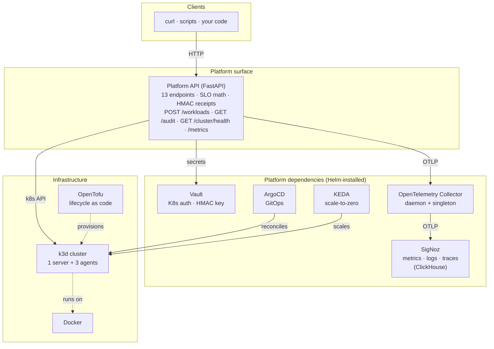

# Project 01 — sre-platform

[](https://github.com/mdas333/sre-platform/actions/workflows/ci.yml)


**An internal developer platform on Kubernetes with SRE-grade reliability engineering built in — not bolted on.**

13 HTTP endpoints, 31 unit tests, three independent cryptographic signatures (commits · images · operation receipts).


> 📖 **Heads up:** the long form of everything in this README — architecture, per-tool rationale, a walkthrough of a single workload creation, SLO math worked example, and the full "proof it works" chapter — is in **[`docs/WALKTHROUGH.md`](./docs/WALKTHROUGH.md)**. This README is the scannable summary.

---

## What it does

The project stands up a four-node k3d cluster and a Platform API that lets you:

- **Create a workload** with a declared SLO target (`POST /workloads`).
- **Query workload health** as an error-budget state (`GET /workloads/{id}/health`).
- **Scale a workload** with an auditable signed receipt (`POST /workloads/{id}/scale`).
- **Read the SLO math** — error budget remaining, burn rate (`GET /workloads/{id}/slo`).
- **Get a plain-English status** via an LLM adapter, disabled by default (`GET /workloads/{id}/explain`).
- **See a 0–100 cluster health score** (`GET /cluster/health`).
- **Audit every mutating operation** via a signed receipt stream (`GET /audit`).

The four primitive requirements — build a cluster, scale it, health-check it, monitor it — all surface as implementation details behind this API. The Platform API exposes only a demo-grade surface in P1: no auth middleware, no quota enforcement, no admission-policy hooks. Those guardrails land in Project 03 (`paved-road`).

---

## Architecture



Four layers, strict boundaries. Nothing in the Platform API cares which tool backs Layer 2, only that Vault, the Kubernetes API, and an OTLP endpoint exist.

---

## Quick start

Prerequisites: Docker Desktop running, Homebrew available.

```bash
# First time only — install the CLIs this project uses.
brew install k3d helm kubectl opentofu hashicorp/tap/vault cosign jq hey asciinema agg

# Verify, then bring the stack up.
../shared/scripts/preflight.sh     # all [ok]
./scripts/cluster-up.sh            # ≈8 min on an 8 GB Docker allocation

# Talk to the Platform API.
kubectl -n sre-platform port-forward svc/platform-api 8080:80 &
curl http://localhost:8080/cluster/health | jq
```

Teardown: `./scripts/cluster-down.sh`.

---

## The Platform API

| Method | Path | Purpose |
|--------|------|---------|
| POST | `/workloads` | Create workload from spec (name, image, replicas, SLO target) |
| GET | `/workloads` | List all platform-managed workloads |
| GET | `/workloads/{id}` | Workload detail |
| GET | `/workloads/{id}/health` | Error-budget-aware state (`healthy` / `burning` / `breached`) |
| GET | `/workloads/{id}/slo` | SLO target, error budget, burn rate |
| POST | `/workloads/{id}/scale` | Scale replicas; emits a signed receipt |
| GET | `/workloads/{id}/explain` | LLM-generated plain-English status (feature-gated) |
| GET | `/cluster/health` | Aggregate 0–100 cluster health score |
| GET | `/cluster/nodes` | Node status, capacity, conditions |
| GET | `/audit` | Signed operation log (verifiable offline) |
| GET | `/metrics` | Prometheus scrape endpoint |
| GET | `/healthz`, `/readyz` | Kubernetes probes |

OpenAPI docs at `/docs` when running.

---

## SLO math — the reliability signal

Each workload registers an SLO at creation — a target, a rolling window, and an indicator. The Platform API computes:

- `error_budget_total = (1 − target) × total_events_in_window`
- `error_budget_consumed = failures_in_window`
- `error_budget_remaining = total − consumed`
- `burn_rate` — consumed rate relative to sustainable rate

`/health` returns `healthy`, `burning`, or `breached` based on budget position — not just HTTP 200. The full math is at `/slo` and as the Prometheus gauges `platform_slo_error_budget_remaining` and `platform_slo_burn_rate`.

**Telemetry source (P1 demo):** the Platform API self-instruments its own request counters (`platform_http_requests_total`, `platform_http_failures_total`) and exposes them on `/metrics`. The OpenTelemetry Collector scrapes the endpoint and forwards to SigNoz — standard Prometheus white-box instrumentation. `scripts/load.sh` injects real HTTP traffic with a configurable failure rate so the error budget visibly burns down. The in-memory SLO counters are bounded and reset on pod restart; a production deployment would ingest ingress / service-mesh metrics over rolling 7- or 30-day windows.

See [ADR 0010](../shared/adr/0010-slo-math-over-dashboards.md) and [WALKTHROUGH chapter 9](./docs/WALKTHROUGH.md#9-slo-math-worked-example) for worked numerical examples.

---

## Signed receipts — the audit differentiator

Every mutating operation emits a receipt signed with HMAC-SHA256 using a key sourced from Vault:

```json
{
  "op_id":       "01J2HR5...",
  "ts":          "2026-04-16T18:22:11Z",
  "actor":       "platform-api@sre-platform",
  "action":      "scale",
  "workload_id": "demo-app",
  "before":      { "replicas": 2 },
  "after":       { "replicas": 5 },
  "trace_id":    "4bf92f35...",
  "kid":         "key-2026-04-16",
  "hmac":        "mQ9vL8..."
}
```

`/audit` returns the stream. `scripts/verify-receipt < receipt.json` re-signs the canonical-JSON payload with the key it reads from Vault and checks the HMAC — valid → `VERIFIED`, tampered → `INVALID`. See [ADR 0009](../shared/adr/0009-hmac-vault-for-receipts.md).

---

## Scaling

Two layers, both demonstrated. The KEDA scale-to-zero clip is the hero GIF at the top of this README. The node-level demo:


**Cluster level** — `scripts/scale-cluster-up.sh` adds an agent node via `k3d node create`; `scripts/scale-cluster-down.sh` cordons, drains, and deletes it, then removes the stale node object from the Kubernetes API.

**Workload level** — the Platform API stays always-on (`minReplicas: 2`) because it is the cluster's control plane. The scale-to-zero narrative lives on a separate `demo-app` workload (`k8s/demo-app/keda-scaledobject.yaml`): `minReplicaCount: 0`, `maxReplicaCount: 3`, triggered by a cron window that KEDA polls every 15 seconds. The cron trigger is deliberate for a reproducible demo; production workloads would use HTTP-rate, Prometheus, Kafka, or SQS triggers. See [ADR 0005](../shared/adr/0005-keda-over-hpa.md).

---

## Observability (SigNoz, OpenTelemetry-native)

The OpenTelemetry Collector runs as a daemonset + singleton deployment with five receivers: `k8s_cluster`, `kubeletstats`, `hostmetrics`, `otlp` (gRPC from the Platform API), and `filelog`. All five flow over OTLP to the SigNoz-built-in collector, which writes to ClickHouse. Metrics, logs, and traces sit in one datastore — a spike clicks through to the trace and the log line that caused it without switching tools.


The `platform-api` service appears with real P99 latency and op-rate computed from the spans above. See [ADR 0004](../shared/adr/0004-signoz-over-prometheus-grafana.md).

---

## Deploy — GitOps with signed images

Deployments happen through ArgoCD, reconciling the `k8s/` tree from `main`. Any manual edit drifts back automatically.


The CI workflow builds the Platform API image with buildx, pushes to GHCR with `main` / `main-<sha>` / `latest` tags, and signs each tag **keyless via GitHub OIDC** — no private key is stored. Verification chains the signature back to `refs/heads/main` of this repo:

```bash
./scripts/verify-image.sh ghcr.io/mdas333/sre-platform/platform-api:main
```

See [ADR 0008](../shared/adr/0008-sigstore-cosign-for-images.md).

---

## Design decisions

| # | Decision |
|---|----------|
| [0001](../shared/adr/0001-monorepo.md) | Monorepo for the portfolio arc |
| [0002](../shared/adr/0002-k3d-over-kind.md) | k3d for local Kubernetes |
| [0003](../shared/adr/0003-opentofu-over-terraform.md) | OpenTofu over Terraform |
| [0004](../shared/adr/0004-signoz-over-prometheus-grafana.md) | SigNoz for observability |
| [0005](../shared/adr/0005-keda-over-hpa.md) | KEDA for workload autoscaling |
| [0006](../shared/adr/0006-vault-k8s-auth.md) | Vault Kubernetes auth for secrets |
| [0007](../shared/adr/0007-fastapi-with-official-k8s-client.md) | FastAPI and the official k8s client |
| [0008](../shared/adr/0008-sigstore-cosign-for-images.md) | Sigstore cosign, keyless via OIDC |
| [0009](../shared/adr/0009-hmac-vault-for-receipts.md) | HMAC with Vault for operation receipts |
| [0010](../shared/adr/0010-slo-math-over-dashboards.md) | SLO math in the Platform API |
| [0011](../shared/adr/0011-pluggable-llm-backend.md) | Pluggable LLM backend |

---

## Tests

```bash
cd platform-api
uv sync
uv run pytest -v
uv run ruff check src tests
```

Suites in `platform-api/tests/`:

- `test_slo_math.py` — budget math, rolling windows, edge cases (zero events, zero budget, target = 100), configurable burn thresholds.
- `test_slo_store.py` — registry invariants: `record()` rejects negative deltas and `failed > total`.
- `test_receipts.py` — HMAC signing and verifier round-trip, key rotation, canonical-JSON determinism, constant-time comparison, tampering detection.

---

## CI

Three jobs on every push (`/.github/workflows/ci.yml` at the repo root):

1. **Platform API — ruff + pytest.** `uv sync`, `ruff check`, `pytest`.
2. **Kubernetes manifests — kubeconform.** Strict schema validation of `k8s/**` with the Datree CRD catalog so KEDA ScaledObject and similar CRDs are recognised.
3. **Build, sign, push to GHCR.** `docker buildx` with GHA cache, metadata-driven tags, push to `ghcr.io/mdas333/sre-platform/platform-api`, then keyless cosign signing — the workflow's OIDC identity is the only signer.

ArgoCD picks up the new image on the next reconcile and rolls out the Deployment.

---

## Status

| Cluster | Platform deps | Platform API | Container image | CI | ArgoCD | Demos |
|:---:|:---:|:---:|:---:|:---:|:---:|:---:|
| ✓ | ✓ | ✓ | ✓ | ✓ | ✓ | ✓ |

4-node k3d cluster provisioned via OpenTofu · Vault / ArgoCD / SigNoz / KEDA / OTel Collector Helm-installed and bootstrapped · 13 FastAPI endpoints with 31 unit tests passing · image signed keyless via GitHub OIDC · `sre-platform` Application Synced / Healthy · cluster-level and KEDA scale-to-zero demos recorded under `docs/demos/`.

---

## See also

- **[Walkthrough](./docs/WALKTHROUGH.md)** — exhaustive beginner-friendly guide, 13 chapters, 7 Mermaid diagrams, inline proof images.
- **[Capabilities index](../shared/capabilities.md)** — what this repository implements, with file pointers.
- **[Architecture decisions](../shared/adr/)** — eleven ADRs, one per real trade-off.
- **[Demos](./docs/demos/)** — source casts + rendered GIFs.
- **Sibling projects** — [`../project-02-ai-sre-agent/`](../project-02-ai-sre-agent/) · [`../project-03-paved-road/`](../project-03-paved-road/) · [`../project-04-sentinel/`](../project-04-sentinel/).
