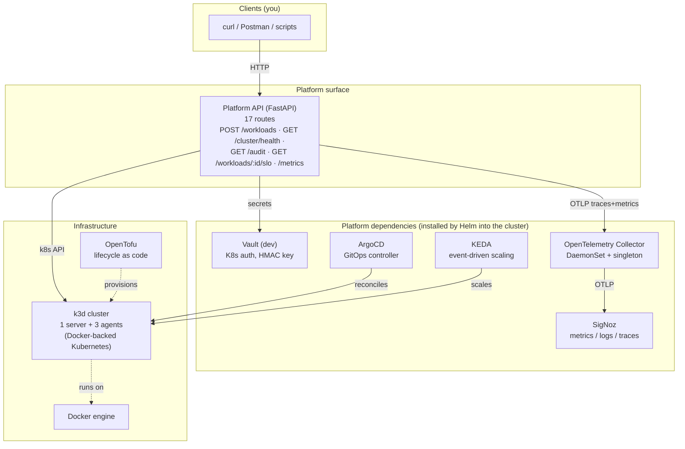
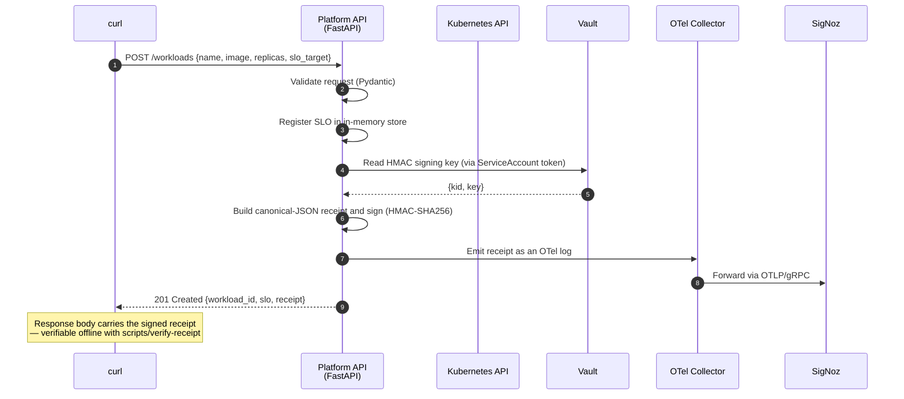
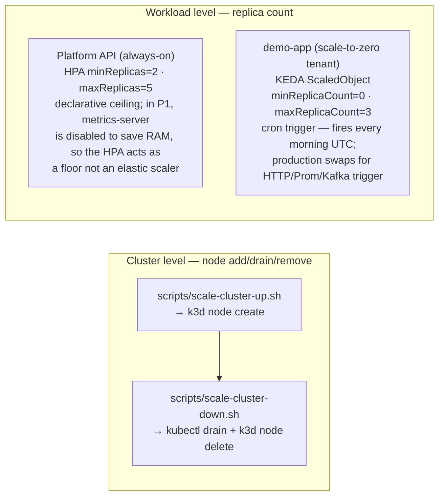
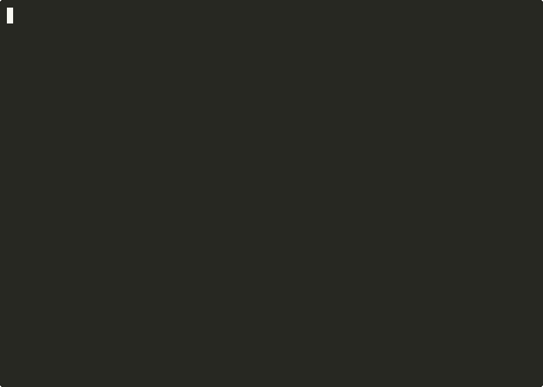
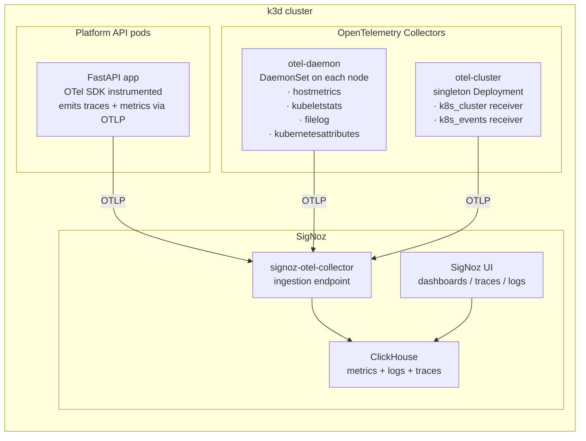
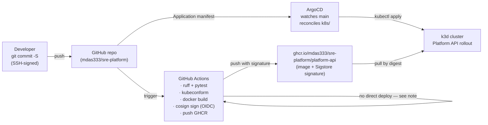
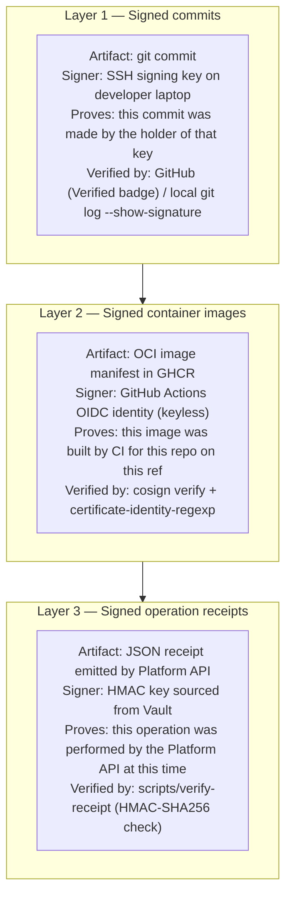
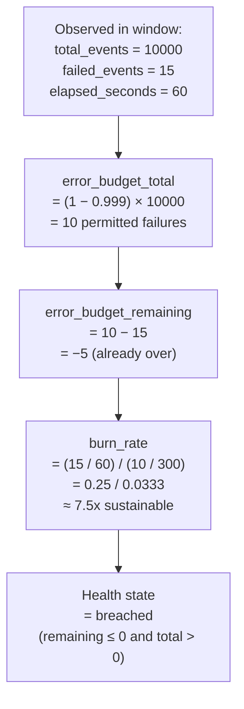
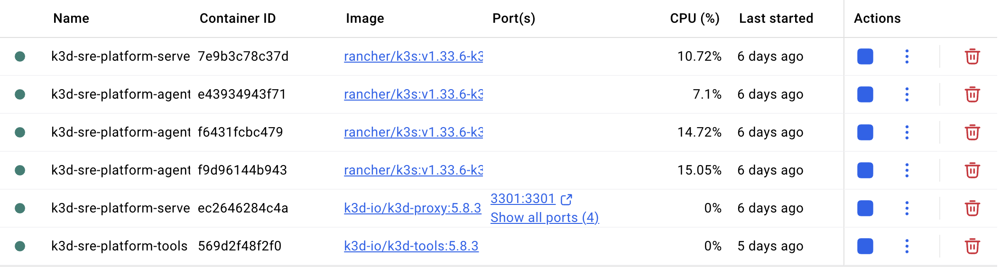

# Walkthrough — `sre-platform` (Project 01)

A plain-language, end-to-end guide to what this project is, what it does, and how the pieces fit together. **No prior knowledge of Kubernetes, DevOps, or SRE is assumed.** Read chapters in order, or jump via the table of contents.

If you are short on time, the chapters with the highest signal are **1** (what problem this solves), **3** (how the pieces fit), **8** (three layers of provenance), and **10** (proof it works).

---

## Table of contents

1. [What problem does this solve?](#1-what-problem-does-this-solve)
2. [The tech stack, one tool at a time](#2-the-tech-stack-one-tool-at-a-time)
3. [How the pieces fit — system layers](#3-how-the-pieces-fit--system-layers)
4. [What happens when you create a workload](#4-what-happens-when-you-create-a-workload)
5. [Two layers of scaling](#5-two-layers-of-scaling)
6. [Observability end-to-end](#6-observability-end-to-end)
7. [GitOps with signed images](#7-gitops-with-signed-images)
8. [Three layers of provenance](#8-three-layers-of-provenance)
9. [SLO math, worked example](#9-slo-math-worked-example)
10. [Proof it works](#10-proof-it-works)
11. [Limitations by design](#11-limitations-by-design)
12. [Glossary](#12-glossary)
13. [Further reading](#13-further-reading)

---

## 1. What problem does this solve?

Modern companies run their products on **Kubernetes** — a system that runs hundreds or thousands of little programs (called *pods*) across many machines. Keeping those programs healthy, fast, and recoverable from failure is the job of two closely-related disciplines:

- **Site Reliability Engineering (SRE)** — treat reliability as a measurable feature. Instead of "is the service up?" (a yes/no question that hides nuance), ask "is it meeting its contract?" — 99.9% of requests should succeed over the last 7 days, for example.
- **Platform Engineering** — build an internal product that other engineers use to ship their code. Instead of every team configuring Kubernetes from scratch, they call a simple API: "deploy this", "scale that", "show me its health." The platform handles everything underneath.

This project builds a small but complete working example of both disciplines at once: an **internal platform** (accessed through an HTTP API) backed by a Kubernetes cluster, with **reliability engineering** baked in (SLOs, error budgets, signed audit receipts, OpenTelemetry observability).

### The analogy

Think of a doctor's visit. A bad health check is "Are you breathing? Yes? Great, bye." A good health check looks at blood pressure, sleep, stress over the last week, lifestyle trends — and tells you where the *budget* for your future health stands. This project does the second thing for software: every workload gets a *reliability budget*, and the platform reports whether it's healthy, burning too fast, or breached — not just "is the pod alive."

### What you get by reading this doc

- A map of which tool does what, and **why** it was chosen.
- Diagrams showing how the tools pass data to each other.
- A walk-through of one complete operation (create a workload, get back a signed receipt).
- Concrete proof the system runs — command output, metrics, screenshots.

---

## 2. The tech stack, one tool at a time

There are 12 tools. Each card below tells you **what it is** in one sentence, **what job it does here**, **why we picked it**, and an **everyday analogy**.

### Docker

- **What:** software that packages a program and everything it needs into a *container* — a portable unit that runs the same way anywhere.
- **Here:** runs the Kubernetes cluster (the nodes are Docker containers themselves), and runs the Platform API image.
- **Why:** industry-standard, free for personal use, what every other tool in this list builds on.
- **Analogy:** a shipping container — same box, same interface, different cargo inside.

### k3d

- **What:** a tool that stands up a Kubernetes cluster entirely inside Docker containers.
- **Here:** the whole cluster — one server, three agents — is 4 Docker containers on your laptop.
- **Why:** multi-node out of the box, starts in seconds, uses real k3s (a CNCF-certified Kubernetes distribution). See [ADR 0002](../../shared/adr/0002-k3d-over-kind.md).
- **Analogy:** a model train set — fully functional, just smaller.

### Kubernetes

- **What:** the orchestrator that decides *where* each program runs, restarts crashed ones, scales up or down, networks them together.
- **Here:** it runs every component — the Platform API, the observability stack, the secrets service, the GitOps controller. All of them are Kubernetes workloads.
- **Why:** it is the industry default. Every cloud supports it natively.
- **Analogy:** an airport traffic controller — keeps planes (pods) in the air, reroutes them when runways (nodes) go down.

### OpenTofu

- **What:** a tool for describing infrastructure as files, which can be applied, re-applied, and torn down deterministically.
- **Here:** describes the k3d cluster declaratively. `tofu apply` brings it up; `tofu destroy` tears it down. See [ADR 0003](../../shared/adr/0003-opentofu-over-terraform.md).
- **Why:** open-source fork of Terraform, identical syntax, governed by the Linux Foundation.
- **Analogy:** a recipe card — the dish is the same every time you follow it, by anyone.

### Helm

- **What:** a package manager for Kubernetes — bundles the dozens of manifests needed to install a complex piece of software into one release.
- **Here:** used to install Vault, ArgoCD, SigNoz, KEDA, and the OpenTelemetry Collector. Each one would be ten to fifty YAML files if installed by hand; `helm install` makes it one command.
- **Why:** industry-standard package format.
- **Analogy:** `apt install` or `brew install`, but for whole distributed systems.

### HashiCorp Vault

- **What:** a secrets store. Stores API keys, passwords, and cryptographic keys, and decides who can read which.
- **Here:** holds the HMAC signing key that the Platform API uses to sign audit receipts. The Platform API proves its identity to Vault using its Kubernetes service-account token — no static passwords live in code or config. See [ADR 0006](../../shared/adr/0006-vault-k8s-auth.md).
- **Why:** genuinely production-grade; uses the Kubernetes auth method which is *the* pattern for pods reading secrets.
- **Analogy:** a bank safety-deposit box whose key you prove you own via the bank's records, not by carrying a physical key.

### ArgoCD

- **What:** a GitOps controller — watches a Git repository and makes sure the cluster state matches what's in Git.
- **Here:** the `k8s/` directory in this repo is the source of truth. Any commit to `main` that changes a manifest gets reconciled automatically. Manual `kubectl edit` gets reverted.
- **Why:** Git is the best audit log in software; let it drive deploys.
- **Analogy:** autopilot — keeps the plane on course; if something knocks it off, it corrects back.

### KEDA

- **What:** Kubernetes Event-Driven Autoscaling — scales workloads up and down based on *any* signal, not just CPU.
- **Here:** drives the demo workload from zero replicas up to two on a trigger, back to zero when idle. See [ADR 0005](../../shared/adr/0005-keda-over-hpa.md).
- **Why:** the standard Kubernetes autoscaler (HPA) can't scale to zero cleanly; KEDA can, and supports 60+ trigger types.
- **Analogy:** a motion-sensor light — off when no-one is there, on when movement starts.

### SigNoz

- **What:** an observability platform — stores and queries metrics, logs, and traces in one database (ClickHouse).
- **Here:** the destination for all telemetry from the Platform API, the cluster, and the workloads. See [ADR 0004](../../shared/adr/0004-signoz-over-prometheus-grafana.md).
- **Why:** OpenTelemetry-native. Metrics, logs, and traces in one place means correlation is a single click, not three tool switches.
- **Analogy:** a hospital's unified patient record instead of three separate filing cabinets.

### OpenTelemetry (OTel)

- **What:** a vendor-neutral standard and a family of agents for collecting telemetry from any program or platform.
- **Here:** an OTel Collector runs as a DaemonSet (one per node, collecting per-node metrics and logs) plus a singleton Deployment (collecting cluster-wide events). The Platform API is instrumented with the OTel SDK — traces and metrics flow through the same pipeline.
- **Why:** it's the standard. Every modern observability tool speaks OTLP (OTel's wire protocol).
- **Analogy:** USB for data. One plug, any vendor.

### Sigstore cosign

- **What:** a tool for cryptographically signing container images and verifying them.
- **Here:** the CI pipeline signs every image it pushes, using GitHub's OIDC identity as the key (no private key to manage). Anyone can verify the signature with one command. See [ADR 0008](../../shared/adr/0008-sigstore-cosign-for-images.md).
- **Why:** image supply-chain attacks are a real concern; cosign is the open-source standard answer.
- **Analogy:** a wax seal on a letter — proves the sender, and breaks if tampered with.

### FastAPI

- **What:** a modern Python framework for building HTTP APIs.
- **Here:** the Platform API itself — 17 routes serving the developer-facing platform surface. See [ADR 0007](../../shared/adr/0007-fastapi-with-official-k8s-client.md).
- **Why:** async-native, auto-generated OpenAPI docs, typed request/response via Pydantic.
- **Analogy:** a strongly-typed contract between clients and your service.

### Supporting tools

- **uv** — an extremely fast Python package manager. Replaces `pip` + `virtualenv`.
- **GitHub Actions** — the CI system. Runs lint, tests, image build, and signing on every push.
- **ruff** — a lint-and-format tool for Python.
- **pytest** — the Python test runner.

---

## 3. How the pieces fit — system layers

All 12 tools stack into four conceptual layers. Each layer depends only on the ones below it.



**What each layer is responsible for:**

1. **Infrastructure** — bring the cluster into existence and keep it there. OpenTofu drives lifecycle; Docker + k3d do the actual work; four Linux "nodes" exist as Docker containers.
2. **Platform dependencies** — the shared services every workload on the cluster benefits from. Vault issues credentials; ArgoCD reconciles state from Git; KEDA scales pods; OTel + SigNoz collect and store telemetry.
3. **Platform surface** — the product the platform offers to developers. In this project that's a single FastAPI service exposing 17 routes. It talks to Kubernetes and Vault so the caller doesn't have to.
4. **Clients** — anyone consuming the platform. For the demo, that's `curl` and a few helper scripts. In a real organisation, it'd be each internal team's deployment tooling.

The boundary between layers is strict: nothing in Layer 3 (the Platform API) cares which tool in Layer 2 is installed, as long as Vault, Kubernetes, and OTLP endpoints exist. Swap Vault for a different secret store, and only Layer 2 changes.

---

## 4. What happens when you create a workload

This chapter traces a single HTTP call — creating a workload via `POST /workloads` — through every component it touches. The diagram first, then step-by-step.



**Step by step:**

1. **Client sends the request** — a JSON body names the workload, the image, the desired replicas, the SLO target and window.
2. **Platform API validates the shape** — FastAPI + Pydantic refuse malformed inputs before any side-effect happens.
3. **Register the SLO** — a small in-memory registry records the workload's target, window, and start time. From this moment, every request the workload handles can be budgeted.
4. **Authenticate to Vault** — the API presents its pod's ServiceAccount token to Vault. Vault verifies the token against the Kubernetes API and hands back the current HMAC signing key.
5. **Sign the receipt** — the API builds a canonical-JSON representation of the operation (sorted keys, no whitespace) and HMACs it with the key. The resulting signature plus the key-id (`kid`) are attached to the receipt.
6. **Emit the receipt** — the receipt goes out as an OTel log to the local OTel Collector.
7. **Forward to SigNoz** — the Collector relays over OTLP/gRPC to SigNoz's ingestion endpoint. The receipt is now queryable from the observability UI.
8. **Respond to the client** — the API returns the full receipt in the response so the caller has a signed acknowledgment of the operation, verifiable offline.

Everything outbound has a 5-second timeout and degrades gracefully: if Vault is unreachable, the API falls back to a clearly-marked dev key and logs a warning; if OTel is unreachable, the receipt still goes in the in-memory buffer that `/audit` serves.

---

## 5. Two layers of scaling

There are two fundamentally different kinds of scaling in Kubernetes — *cluster-level* (how many physical machines) and *workload-level* (how many copies of one program). This project demonstrates both, and draws a hard line between them.



### Cluster-level

Adding a node expands capacity for new pods. Removing one frees the underlying memory and CPU.

```bash
./scripts/scale-cluster-up.sh
# k3d node create → new agent container → ready in ~5s → scheduled for workloads

./scripts/scale-cluster-down.sh
# kubectl cordon → drain → k3d node delete → kubectl delete node
```

The recorded GIF (reproduced below) captures the full cycle — 4 nodes → 5 → 4.



### Workload-level

This is where scale-to-zero lives. **The Platform API itself is never scaled to zero** — it is the control plane, and a cold start would make the API look broken to anyone calling `/health` at the wrong moment. Its HPA keeps `minReplicas: 2`.

The scale-to-zero demonstration runs on a separate **demo-app** workload, a small nginx container managed by a KEDA `ScaledObject`. Its trigger is a cron window — deterministic, reproducible for recording. (In production you'd use an HTTP-rate, Prometheus, Kafka, or SQS trigger instead.)

The GIF below shows KEDA scaling demo-app from 0 → 2 replicas in ~18 seconds after the trigger becomes active.


---

## 6. Observability end-to-end

Three kinds of telemetry need to flow out of the cluster and into a queryable store: **metrics** (counters, gauges), **logs** (text events), and **traces** (causal chains across services). This project uses OpenTelemetry everywhere and lands in SigNoz.



Three signal sources, one ingestion endpoint, one database:

- **Platform API** emits request traces (FastAPI instrumented), request metrics (per-route latency histogram, Prometheus gauges for SLO state), and structured logs.
- **otel-daemon** runs on every node and collects host CPU/memory/disk, kubelet pod stats, and container logs.
- **otel-cluster** runs once and collects cluster-level events (pod phase changes, deployment availability, node conditions) plus Kubernetes warning events.

All three forward via OTLP/gRPC to the SigNoz-built-in OTel Collector, which writes to ClickHouse. The SigNoz UI reads from the same database — so a metric spike can be clicked through to the trace that caused it, which can be clicked through to the log line from that same request. No label-juggling across three tools.

---

## 7. GitOps with signed images

The delivery pipeline separates *building* (done in CI) from *deploying* (done by ArgoCD). Every artifact between the two is cryptographically signed.



The flow:

1. **Commit.** Every commit is SSH-signed with a key uploaded to GitHub as a "Signing Key." GitHub shows a green "Verified" badge; anyone can verify locally too.
2. **CI runs.** On every push, the three-job workflow runs: lint + tests, manifest validation (`kubeconform`), and on `main` only, image build + cosign sign + GHCR push.
3. **Sign the image with cosign, keyless.** The CI workflow's OIDC identity — not a private key — signs the image. Sigstore's Fulcio issues a short-lived certificate tied to `refs/heads/main` of this repo; Rekor (a public transparency log) records the signature. No key to manage, rotate, or leak.
4. **Push to GHCR.** The image plus its signature land in GitHub Container Registry.
5. **Reconcile with ArgoCD.** The ArgoCD `Application` watches `main`; any change to the `k8s/` tree — including an image tag bump — triggers a reconcile. ArgoCD applies the manifest; Kubernetes pulls the image from GHCR.
6. **Verify, optionally.** Anyone — a reviewer, a security team, a future you — can run:

```bash
cosign verify \
  --certificate-identity-regexp '^https://github\.com/mdas333/sre-platform/\.github/workflows/ci\.yml@refs/heads/.*' \
  --certificate-oidc-issuer 'https://token.actions.githubusercontent.com' \
  ghcr.io/mdas333/sre-platform/platform-api:main
```

If the signature chains back to a CI run on `refs/heads/main` of this repo, `cosign` prints the claims and exits 0. If anything else signed the image, it fails.

---

## 8. Three layers of provenance

The project produces three independent cryptographic signatures, each proving a different thing.



Each layer covers a different stage of the software's life:

| Layer | Covers | Tool | Secret management |
|---|---|---|---|
| Commits | Source history — who wrote the code | SSH signing | Developer key; stored on laptop |
| Images | Build artifacts — who built and pushed the image | Sigstore cosign, keyless via OIDC | No key to manage (OIDC identity is ephemeral) |
| Receipts | Runtime operations — who performed which action | HMAC-SHA256 | Key in Vault; rotatable, auditable |

Taken together, the three mean a recruiter or auditor can answer *who wrote this code, who built the image running, and who performed this operation* without trusting any single party.

---

## 9. SLO math, worked example

Service Level Objectives (SLOs) are the core reliability signal. Instead of "was the request successful or not," the question becomes "how much of our error budget have we consumed, and how fast?"

### The math

For any rolling window:

- **Error budget total** = `(1 − target) × total_events`
- **Error budget remaining** = `total − failed_events`
- **Burn rate** = `(failed / elapsed) / (total_budget / window)` — 1.0 is sustainable; 2.0 means burning twice as fast as the budget allows; ∞ means zero budget but failures.

The Platform API computes all four from simple counters the workload keeps.

### Worked example

A workload has `target = 99.9%`, `window = 300 seconds` (5 minutes for demo-speed), `indicator = http_success_rate`.



The `/workloads/{id}/slo` endpoint returns this full state; `/workloads/{id}/health` returns just the state (`healthy` / `burning` / `breached`); `/metrics` exposes `platform_slo_error_budget_remaining` and `platform_slo_burn_rate` as Prometheus gauges for alerting.

In the demo, `scripts/load.sh failing` injects a configurable failure rate so the error budget visibly burns down over a short window — see [ADR 0010](../../shared/adr/0010-slo-math-over-dashboards.md) for the full telemetry contract.

---

## 10. Proof it works

The following evidence was captured from the live cluster. Each of the four sub-sections below that would benefit from a UI screenshot has the screenshot slot marked; the text fallback for that section is already in place, so the evidence chain is complete either way.

### Live cluster — `kubectl get nodes`

```text
$ kubectl get nodes -o wide --no-headers
k3d-sre-platform-agent-0    Ready  <none>                  v1.33.6+k3s1
k3d-sre-platform-agent-1    Ready  <none>                  v1.33.6+k3s1
k3d-sre-platform-agent-2    Ready  <none>                  v1.33.6+k3s1
k3d-sre-platform-server-0   Ready  control-plane,master    v1.33.6+k3s1
```

Four nodes (one server + three agents) running k3s on containerd inside Docker. This is the cluster every other proof in this chapter runs on.

### Platform API responding

```text
$ curl -s http://localhost:8080/healthz
{"status":"ok"}

$ curl -s http://localhost:8080/cluster/health | jq
{
  "score": 100.0,
  "breakdown": {
    "nodes":       { "points": 40.0, "ready": 4, "total": 4 },
    "pods":        { "points": 30.0, "running": 2, "total": 2 },
    "deployments": { "points": 20.0, "total": 2 },
    "events":      { "points": 10.0 }
  }
}
```

The API is talking to the Kubernetes API (to count nodes and pods), computing the aggregate health score in Python, and returning it as JSON. No mocks.

### Receipt with Vault-sourced signing key

```text
$ curl -s -X POST -H 'content-type: application/json' \
    -d '{"name":"doc-demo-app","image":"nginx:1.27","replicas":2,"slo_target":99.9,"slo_window_seconds":300}' \
    http://localhost:8080/workloads | jq .receipt
{
  "op_id":       "437fddf4-e813-401e-864a-160974f6ab66",
  "ts":          "2026-04-22T16:47:15Z",
  "actor":       "platform-api@sre-platform",
  "action":      "create",
  "workload_id": "doc-demo-app",
  "before":      {},
  "after":       { "image": "nginx:1.27", "replicas": 2 },
  "trace_id":    null,
  "kid":         "key-2026-04-18",
  "hmac":        "HEzADFWOXmUpZYqn2H1X/GqBLup25glYDoe/j2Qi4ts="
}
```

The `kid` field is `key-2026-04-18` — the date-stamped key seeded by `infrastructure/vault/bootstrap.sh` into Vault. If Vault had been unreachable, this field would read `dev-key-0` (the fallback). That one field is the integration test: it proves the ServiceAccount → Vault Kubernetes auth → KV read path works end-to-end.

### Cosign keyless verification of the CI-built image

```text
$ cosign verify \
    --certificate-identity-regexp '^https://github\.com/mdas333/sre-platform/\.github/workflows/ci\.yml@refs/heads/.*' \
    --certificate-oidc-issuer 'https://token.actions.githubusercontent.com' \
    ghcr.io/mdas333/sre-platform/platform-api:main

Verification for ghcr.io/mdas333/sre-platform/platform-api:main --
The following checks were performed on each of these signatures:
  - The cosign claims were validated
  - Existence of the claims in the transparency log was verified offline
  - The code-signing certificate was verified using trusted certificate authority certificates
```

The claims embedded in each signature identify the workflow that produced the image:

```text
githubWorkflowRepository: mdas333/sre-platform
githubWorkflowName:       ci
githubWorkflowRef:        refs/heads/main
githubWorkflowSha:        00b6149c55d94c0a6b6a024665dee07787db1807
githubWorkflowTrigger:    push
```

Any image whose signature does not chain back to a workflow run in this repo on `main` fails this check.

### Docker Desktop — containers running  *(screenshot slot: Docker Desktop)*

<!-- PROOF-IMAGE-1: Docker Desktop Containers tab showing k3d-sre-platform-* entries. Drop file as docs/proof-images/docker-desktop.png then replace this HTML comment with  -->

**Text fallback** (`docker ps` showing the k3d containers that make up the cluster):

```text
$ docker ps --format 'table {{.Names}}\t{{.Image}}\t{{.Status}}' | grep -E 'NAMES|k3d'
NAMES                       IMAGE                            STATUS
k3d-sre-platform-tools      ghcr.io/k3d-io/k3d-tools:5.8.3   Up 4 days
k3d-sre-platform-serverlb   ghcr.io/k3d-io/k3d-proxy:5.8.3   Up 4 days
k3d-sre-platform-agent-2    rancher/k3s:v1.33.6-k3s1         Up 4 days
k3d-sre-platform-agent-1    rancher/k3s:v1.33.6-k3s1         Up 4 days
k3d-sre-platform-agent-0    rancher/k3s:v1.33.6-k3s1         Up 4 days
k3d-sre-platform-server-0   rancher/k3s:v1.33.6-k3s1         Up 4 days
```

One server, three agents, a proxy, and a helper tools container — exactly what a k3d multi-node cluster expects to see.

### ArgoCD Application state  *(screenshot slot: ArgoCD UI)*

<!-- PROOF-IMAGE-2: ArgoCD UI at http://localhost:8080 showing the sre-platform Application card with Synced/Healthy status and the 12 reconciled resources. Drop file as docs/proof-images/argocd-ui.png then replace this HTML comment. -->

**Text fallback** (`kubectl get application -n argocd sre-platform` summary):

```text
sync:       Synced
health:     Healthy
revision:   00b6149c55d94c0a6b6a024665dee07787db1807

resources reconciled:
  Namespace/sre-platform                      Synced
  Service/demo-app                            Synced
  Service/platform-api                        Synced
  ServiceAccount/platform-api                 Synced
  Deployment/demo-app                         Synced
  Deployment/platform-api                     Synced
  HorizontalPodAutoscaler/platform-api        Synced
  ScaledObject/demo-app                       Synced
  ClusterRole/platform-api-cluster-read       Synced
  ClusterRoleBinding/platform-api-cluster-read Synced
  Role/platform-api-read                      Synced
  RoleBinding/platform-api-read               Synced
```

Twelve resources, reconciled from the commit on `main`. Any `kubectl edit` against them drifts back.

### SigNoz ingestion  *(screenshot slot: SigNoz UI)*

To view the SigNoz UI locally: `kubectl -n signoz port-forward svc/signoz 3301:8080` and open http://localhost:3301 in a browser.


<!-- PROOF-IMAGE-3: SigNoz UI at http://localhost:3301 showing the Services view or a traces list with the platform-api service visible. Drop file as docs/proof-images/signoz-ui.png then replace this HTML comment. -->

**Text fallback** (SigNoz pods running and OTLP ingestion endpoint reachable):

```text
$ kubectl -n signoz get pods
NAME                                           READY   STATUS      AGE
chi-signoz-clickhouse-cluster-0-0-0            1/1     Running     4d21h
signoz-0                                       1/1     Running     4d21h
signoz-clickhouse-operator-554f9bcb98-6ml2g    2/2     Running     4d21h
signoz-otel-collector-65d7b49cc5-g2pnc         1/1     Running     4d21h
signoz-telemetrystore-migrator-sh6jk           0/1     Completed   4d21h
signoz-zookeeper-0                             1/1     Running     4d21h
```

ClickHouse, the SigNoz binary, the operator, the OTel ingestion collector, and ZooKeeper — all the moving parts of a self-hosted SigNoz install, all Ready.

### GitHub Actions — green CI  *(screenshot slot: GHA UI)*

<!-- PROOF-IMAGE-4: GitHub Actions page for mdas333/sre-platform showing the most recent ci workflow run with three green-checkmark jobs (Platform API, manifests, build+sign). Drop file as docs/proof-images/gha.png then replace this HTML comment. -->

**Text fallback** (most recent four workflow runs, queried via GitHub's public REST API):

```text
sha        title                                                   status      result
--------   -----------------------------------------------------   ---------   -------
00b6149c   Polish READMEs with CI badge, demo GIFs, and load gen   completed   success
19e658f5   Record scaling demos (cluster nodes + KEDA scale-to-)   completed   success
07fcc638   Swap demo-app HPA for KEDA ScaledObject with scale-t)   completed   success
a8bf02af   Add CI pipeline: ruff, pytest, kubeconform, image bu)   completed   success
```

Every push since the CI workflow landed has been green — lint + tests pass, manifests validate, image builds + signs + pushes.

### The two recorded demos

Both of these live in [`docs/demos/`](./demos/) and also appear inline in Chapter 5.


---

## 11. Limitations by design

Every real system has trade-offs. Being honest about them is part of the signal. The limits below are **deliberate for Project 01** and each one is paired with the production path documented in its ADR.

| Limit | Why in P1 | Production path |
|---|---|---|
| Platform API `/workloads` has no auth, quota, or admission policy | Demo-grade surface; keeps the focus on SLO + receipts | Bearer-token middleware + OPA/Kyverno admission — lands in Project 03 (`paved-road`) |
| Receipts live in an in-memory buffer (last 200) | Shows the HMAC + verifier design without a persistence dependency | Append-only log or ClickHouse via SigNoz; see [ADR 0009](../../shared/adr/0009-hmac-vault-for-receipts.md) |
| Single static HMAC signing key (no rotation) | P1 cluster is ephemeral; rotation is a CronJob, not a code path | Daily rotation with grace window; verifier already accepts multiple `kid` values |
| Vault runs in dev mode | Zero-config for a single-laptop setup | Raft storage + auto-unseal via a KMS |
| metrics-server disabled in k3d config | Saves ~100 MB RAM; KEDA's metric adapter covers what we need | Re-enable for proper HPA CPU scaling in production |
| `/workloads/{id}/scale` emits a signed intent receipt but does not yet patch the Deployment | Signing path validated; write-back requires extra RBAC + conflict handling | Add scale patching with an explicit RBAC verb when moving past demo scope |
| KEDA demo trigger is cron | Deterministic for a recorded demo | HTTP-rate (via KEDA HTTP add-on), Prometheus, Kafka, or SQS triggers depending on workload |
| LLM `/explain` is off by default | Zero-friction clone-and-run; no API key required | User opts in with either Gemini (free AI Studio tier) or Ollama (offline local model) |

---

## 12. Glossary

Plain-language definitions. If a term here is unclear, the deeper [`shared/glossary.md`](../../shared/glossary.md) may help.

- **Pod** — one running instance of your program, plus its sidecars. The smallest thing Kubernetes schedules.
- **Node** — a machine (virtual, physical, or a Docker container in k3d) that runs pods.
- **Namespace** — a logical partition inside the cluster. Like a folder for resources.
- **Deployment** — a declaration: "I want N identical pods running this container." Kubernetes keeps it true.
- **Service** — a stable network address that routes traffic to a set of pods, which may come and go.
- **ServiceAccount** — the pod's identity. Used when talking to the Kubernetes API or to Vault.
- **RBAC** — role-based access control. What a ServiceAccount is allowed to do.
- **Helm chart** — a packaged set of Kubernetes manifests + templating.
- **HPA** — Horizontal Pod Autoscaler. Scales pod counts based on CPU/memory.
- **ScaledObject** — KEDA's richer version of HPA. Scales on any configured event source.
- **OTel / OTLP** — OpenTelemetry / its wire protocol.
- **SLO / SLI** — Service Level Objective / Indicator. The target and what you measure against it.
- **Error budget** — the total failures allowed in a window if you stay at your SLO.
- **Burn rate** — how quickly you are consuming error budget, relative to sustainable.
- **GitOps** — Git-as-source-of-truth for cluster state; a controller reconciles reality to Git.
- **Keyless signing** — signing without a long-lived private key, using a short-lived identity from an OIDC provider instead.
- **HMAC** — a symmetric signature: both signer and verifier share a key, fast to compute, good for in-band use.
- **OCI image** — a container image in the format every modern runtime (Docker, containerd, Podman) understands.

---

## 13. Further reading

### Architecture Decision Records (in this repo)

Read in order for the design rationale:

- [ADR 0001 — Monorepo for the arc](../../shared/adr/0001-monorepo.md)
- [ADR 0002 — k3d over Kind / Minikube](../../shared/adr/0002-k3d-over-kind.md)
- [ADR 0003 — OpenTofu over Terraform](../../shared/adr/0003-opentofu-over-terraform.md)
- [ADR 0004 — SigNoz over Prometheus + Grafana](../../shared/adr/0004-signoz-over-prometheus-grafana.md)
- [ADR 0005 — KEDA over HPA for scale-to-zero](../../shared/adr/0005-keda-over-hpa.md)
- [ADR 0006 — Vault Kubernetes auth](../../shared/adr/0006-vault-k8s-auth.md)
- [ADR 0007 — FastAPI + official k8s client](../../shared/adr/0007-fastapi-with-official-k8s-client.md)
- [ADR 0008 — Sigstore cosign, keyless](../../shared/adr/0008-sigstore-cosign-for-images.md)
- [ADR 0009 — HMAC + Vault for receipts](../../shared/adr/0009-hmac-vault-for-receipts.md)
- [ADR 0010 — SLO math in the API](../../shared/adr/0010-slo-math-over-dashboards.md)
- [ADR 0011 — Pluggable LLM backend](../../shared/adr/0011-pluggable-llm-backend.md)

### External

- The [Site Reliability Engineering book](https://sre.google/sre-book/table-of-contents/) (free online) — the canonical text on SRE practice.
- [OpenTelemetry documentation](https://opentelemetry.io/docs/).
- [CNCF landscape](https://landscape.cncf.io/) — map of every tool mentioned here in context.
- [Sigstore overview](https://docs.sigstore.dev/).
